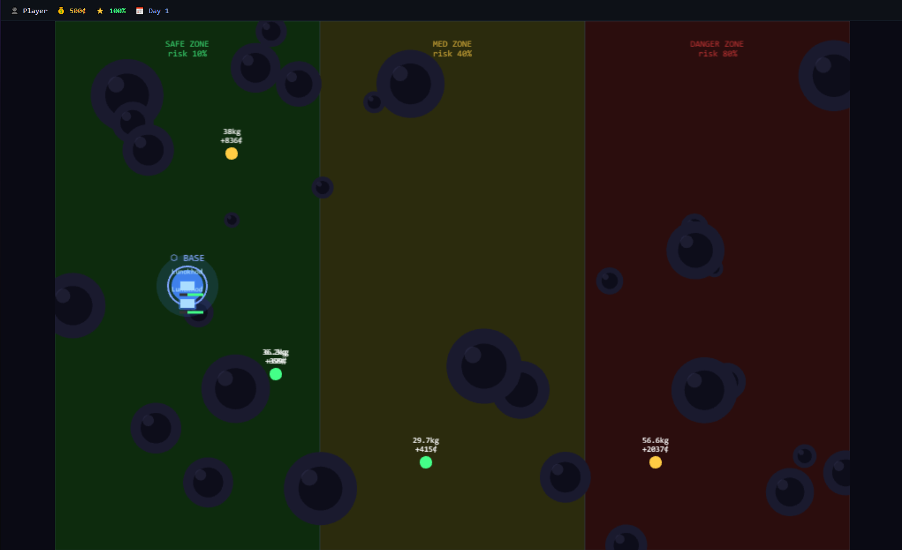
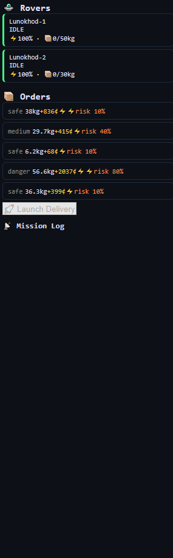
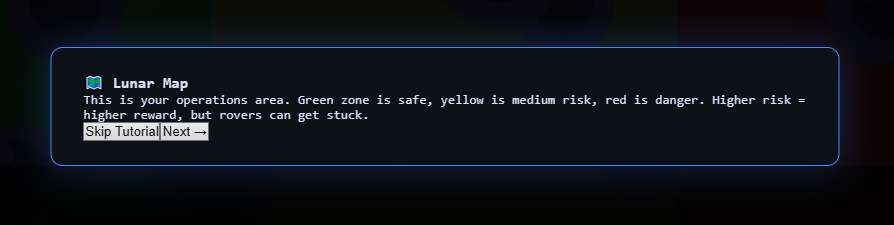

# 🌙 Moon Courier Crisis

Игровой симулятор лунной доставки. Управляй роверами, выполняй заказы, рассчитывай риски и не дай рейтингу лунной базы упасть до нуля.

Проект находится в разработке.

---


## Скриншоты

### Игровая карта



### Панель управления



### Туториал



---

## Стек

| Слой | Технологии |
|------|------------|
| Backend | Python 3.13, FastAPI, SQLAlchemy 2.0, asyncpg, Alembic, Pydantic 2 |
| Database | PostgreSQL 16 |
| Frontend | React 19, TypeScript, Vite, Phaser 3, Zustand, Axios |
| Infrastructure | Docker, Docker Compose |
| Code quality | Ruff, mypy, ESLint, TypeScript, Prettier |
| CI/CD | GitHub Actions |

---

## Архитектура

Проект разделён на два независимых приложения:

```text
moon-courier-crisis/
├── backend/
│   ├── alembic/
│   ├── app/
│   ├── tests/
│   ├── Dockerfile
│   └── pyproject.toml
│
├── frontend/
│   ├── src/
│   ├── Dockerfile
│   ├── package.json
│   └── tsconfig.json
│
├── docker-compose.yml
├── .env.example
└── README.md
```

Backend предоставляет REST API для игровой логики и работы с PostgreSQL.

Frontend отвечает за интерфейс игры, карту и визуализацию движения роверов.

---

## Быстрый старт

### Требования

- Python 3.11+
- Node.js 22+
- npm 10+
- Docker Desktop / Docker Engine

### Backend

```bash
cd backend

python -m venv .venv
```

Windows:

```powershell
.venv\Scripts\activate
```

Linux/macOS:

```bash
source .venv/bin/activate
```

Установить зависимости:

```bash
python -m pip install --upgrade pip
pip install -e ".[dev]"
```

### Frontend

```bash
cd frontend
npm install
```

Запуск development-сервера:

```bash
npm run dev
```

Frontend будет доступен по адресу:

```text
http://localhost:5173
```

### Docker Compose

Создать `.env`:

```bash
cp .env.example .env
```

Для Windows PowerShell:

```powershell
Copy-Item .env.example .env
```

Запустить инфраструктуру:

```bash
docker compose up --build
```

API будет доступен по адресу:

```text
http://localhost:8000
```

Swagger:

```text
http://localhost:8000/docs
```

---

## Как играть

1. Введи никнейм - создаётся профиль игрока.
2. Пройди короткий туториал или пропустите его.
3. На карте появляются доступные заказы.
4. Выберите заказ и подходящий ровер.
5. Проверьте грузоподъёмность и запас батареи.
6. Запустите доставку.
7. Следите за результатом в журнале событий.
8. Завершите игровой день и продолжайте развитие базы.

**Цель:** выполнять доставки, зарабатывать кредиты и удерживать рейтинг базы выше нуля.

---

## Игровая логика

### Вес и батарея

Стоимость батареи для маршрута рассчитывается по формуле:

```text
battery_cost =
    (distance_km / 80) × 100
    × (1 + zone_risk)
    × (1 + weight_ratio × 0.5)
```

Где:

- `distance_km` -расстояние до точки доставки;
- `zone_risk` -коэффициент риска зоны;
- `weight_ratio` -отношение веса заказа к грузоподъёмности ровера.

Если необходимый запас батареи превышает доступный, доставка блокируется.

---

### Скорость доставки

```text
time =
    distance /
    (30 km/h / (1 + weight_ratio × 0.4))
```

Чем тяжелее груз относительно грузоподъёмности ровера, тем ниже скорость доставки.

---

### Риск доставки

Каждая доставка имеет вероятность провала:

```text
fail_chance = zone_risk × 0.4
```

При провале:

- ровер может застрять;
- заказ получает статус `failed`;
- рейтинг базы уменьшается.

Застрявший ровер может быть восстановлен в следующем игровом дне.

---

### Невозможные доставки

Доставка отклоняется, если:

- ровер уже занят - `rover_busy`;
- превышена грузоподъёмность - `overload`;
- недостаточно батареи - `not_enough_battery`;
- маршрут физически недостижим - `impossible_route`.

API использует соответствующие HTTP-ошибки для этих сценариев.

---

### Награда

Базовая награда зависит от срочности заказа:

```text
reward = base_reward × urgency
```

где `urgency` принимает значения от 1 до 3.

Срочные заказы потенциально выгоднее, но могут быть связаны с более рискованными маршрутами.

---

## Карта

Игровая карта разделена на три зоны:

| Зона | Риск | Особенности |
|------|------|-------------|
| Safe | 10% | Низкий риск, меньшая награда |
| Medium | 40% | Баланс риска и награды |
| Danger | 80% | Высокая награда, высокий риск |

Карта генерируется процедурно с фиксированным seed, поэтому её структура остаётся одинаковой между запусками.

Роверы перемещаются по маршрутам с промежуточными вэйпоинтами, а не по прямой линии.

---

## Структура данных

Основные сущности:

| Таблица | Назначение |
|---------|------------|
| `players` | Профиль игрока, кредиты, рейтинг и игровой день |
| `rovers` | Состояние роверов, батарея, загрузка и позиция |
| `orders` | Заказы, вес, награда, срочность и координаты |
| `deliveries` | Запущенные доставки и их результаты |
| `game_events` | История игровых событий и изменения ресурсов |

Идентификаторы сущностей используют UUID.

Состояние текущего игрока хранится на фронтэнде и восстанавливается после перезагрузки страницы.

---

## API

Основные эндпоинты:

```text
POST  /players/
GET   /players/{id}
PATCH /players/{id}/tutorial

GET   /game/{player_id}/rovers
GET   /game/{player_id}/orders
POST  /game/{player_id}/orders/generate
POST  /game/{player_id}/next-day
GET   /game/{player_id}/events

POST  /deliveries/
POST  /deliveries/{id}/resolve
```

Полная документация API доступна через Swagger:

```text
http://localhost:8000/docs
```

---

## Разработка

Backend:

```bash
cd backend

pytest
ruff check .
mypy .
```

Frontend:

```bash
cd frontend

npm run lint
npm run build
npm run format:check
```

---

## Использование AI

Проект разрабатывается с использованием AI-инструментов.

AI используется как вспомогательный инструмент для:

- обсуждения архитектурных решений;
- поиска вариантов реализации;
- анализа потенциальных проблем;
- генерации шаблонного кода;
- проверки отдельных технических решений.

Сгенерированный код проверяется вручную, адаптируется под архитектуру проекта и тестируется перед использованием.

---

## Архитектурные решения и компромиссы

### REST API вместо WebSocket

Для текущей игровой механики достаточно REST API и периодического обновления состояния.

WebSocket может быть добавлен в дальнейшем, если потребуется более частая синхронизация состояния доставки в реальном времени.

### UUID вместо ID

UUID используются для публичных идентификаторов сущностей и предотвращают простой последовательный перебор идентификаторов.

### Фиксированный seed карты

Фиксированный seed позволяет воспроизводить одну и ту же структуру карты между запусками и упрощает тестирование игровой логики.

---
